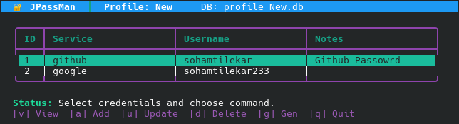

# JPassMan

A zero-dependency, pure-Java Password Manager with robust cryptographic security.



JPassMan securely stores your credentials offline using `AES/GCM/NoPadding` encryption, combined with a `PBKDF2WithHmacSHA256` key derivation function (using 65,536 iterations and a random 16-byte salt).

It features a high-performance **interactive Terminal User Interface (TUI)** modeled after professional text-based applications, supporting mouse clicks, full keyboard navigation, and rich ANSI colors.

## 🚀 Features
- **Zero External Dependencies**: Operates entirely on standard JDK libraries, ensuring no supply-chain vulnerabilities.
- **Multiple User Profiles**: Instantly switch between completely isolated credential databases (`profile_name.db`).
- **Interactive TUI**: 
  - True button-focus states via `Tab`/`Shift+Tab` or Arrow Keys.
  - SGR Mouse Tracking (click UI buttons directly from your terminal emulator).
  - Rapid table navigation using `Home`, `End`, `PgUp`, `PgDn`.
- **Built-in Password Generator**: Quickly generate highly secure, customizable passwords.
- **Classic CLI Fallback**: Run in standard line-by-line CLI mode if preferred.

## 🛠 Project Structure (Maven Standard)

The project follows a standardized Maven file hierarchy:
```text
JPassMan/
├── pom.xml                 # Maven build configuration
├── src/main/java/com/jpassman/
│   ├── PasswordManager.java     # CLI Entrypoint
│   ├── TuiPasswordManager.java  # TUI Entrypoint
│   ├── Database.java            # IO & Serialization
│   ├── CryptoUtils.java         # Encryption Engine
│   └── ...
├── build.sh                # Native fallback compiler script
└── run-tui.sh              # Script to quickly run the TUI wrapper
```

## 📦 Building

You can build the project natively without any build-tools using the provided shell script:
```bash
./build.sh
```
*This will compile the Java classes and package them into an executable JAR (`target/jpassman-1.0.jar`).*

Alternatively, if you have Maven installed, you can use:
```bash
mvn clean package
```

## ▶️ Running the Application

To launch the beautiful **Interactive TUI Mode**:
```bash
./run-tui.sh
```
*(Or manually via: `java -jar target/jpassman-1.0.jar`)*

To launch the **Classic CLI Mode**:
```bash
./run-cli.sh
```
*(Or manually via: `java -cp target/jpassman-1.0.jar com.jpassman.PasswordManager`)*

## 🔒 Security Posture
- **Key Derivation**: `PBKDF2WithHmacSHA256`
- **Encryption**: `AES/GCM/NoPadding` with unique 12-byte IVs for each save operation.
- **Authentication**: GCM tags guarantee cryptographic integrity.
- **Memory Safety**: Actively wipes master password arrays out of memory.
